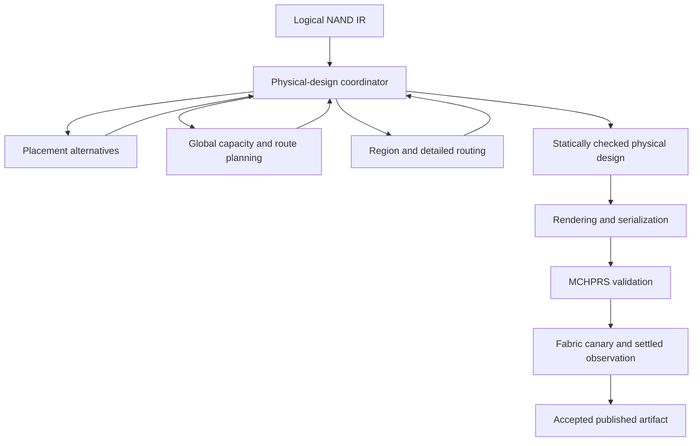
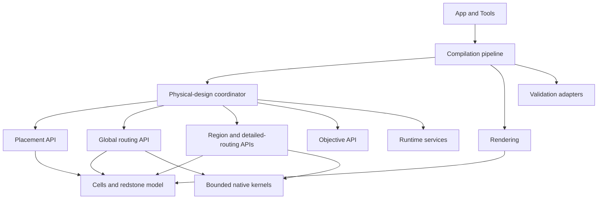
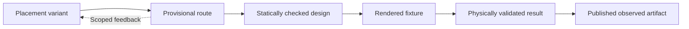

# Physical design architecture overview

**Status:** general architecture overview and implementation direction.

This document explains the intended physical-design architecture at a stable,
system-wide level. It describes responsibilities, dependency direction, state
ownership, result semantics, execution boundaries, and acceptance expectations.
It is not a point-in-time source audit, a benchmark report, or proof that every
described boundary has been implemented.

Detailed requirement specifications live in the
[physical-design pillar catalog](../Pillars/Readme.md). Current source
locations and supported package entrypoints live in the
[source-layout contract](../Reference/ProjectTreeDesignDoc.md).

## Related documentation

- [R1–R10 and N1–N6 requirement catalog](../Pillars/Readme.md)
- [Current source layout and ownership](../Reference/ProjectTreeDesignDoc.md)
- [Compilation pipeline](CompilerPipeline.md)
- [Routing documentation](../Routing/Readme.md)
- [Running tests and structural gates](../Testing/RunningTests.md)
- [Fabric validation contract](FabricServerValidation.md)
- [Repository-layout migration record](../Reference/RepositoryLayoutMigration.md)

## 1. Architecture objective

The physical-design system converts logical NAND connectivity into a compact,
routable, statically checked, rendered, and physically validated Minecraft
redstone artifact.

The architecture is intended to provide:

- Physical correctness by construction where the fast model has declared
  coverage.
- Explicit uncertainty where search or model coverage is incomplete.
- Coordinated placement and routing without cross-stage state mutation.
- Global awareness of shared capacity, fanout, crossings, and congestion.
- Deterministic ownership and result commitment.
- Reusable work with explicit dependency and freshness evidence.
- Persistent parallel execution with bounded CPU, memory, cancellation, and
  shutdown.
- A clear Python policy layer over narrow native compute kernels.
- One shared redstone model for placement, routing, checking, and rendering.
- Authoritative MCHPRS and Fabric acceptance after static checks.

Routing consumes the in-memory NAND intermediate representation. Diagnostic
DOT or NAND files may describe that representation, but the physical-design
pipeline does not use a Graphviz drawing as its placement or routing input.

## 2. System flow



Placement and routing form a feedback loop under the coordinator. Placement
proposes transforms, access, and spatial requirements. Routing proposes
corridors, route trees, claims, and scoped conflicts. Neither stage reaches
into the other's mutable state.

## 3. Governing assumptions

### 3.1 A boundary is behavioral, not merely a directory

A stage boundary exists only when the stage:

1. Receives an explicit immutable request.
2. Receives only the service capabilities needed for that operation.
3. Returns an explicit typed result.
4. Cannot mutate another stage's accepted state.

Moving files or wrapping a broad mutable state object does not establish a new
boundary by itself.

### 3.2 The coordinator is the sole accepted-state writer

Workers, placement, routing, caches, native kernels, renderers, and validation
adapters return proposals, measurements, proofs, observations, or feedback.
Only the physical-design coordinator may:

- Select the active candidate portfolio.
- Decide retries and repairs.
- Change the active routing frontier.
- Accept resource ownership.
- Commit the incumbent design.
- Certify selectively salvaged stale claims.

### 3.3 Legality, feasibility, completeness, and optimality differ

- **Legality** means a candidate satisfies the rules checked by the declared
  model scope.
- **Feasibility** means at least one legal witness exists for the declared
  domain.
- **Completeness** means the declared search domain was exhausted.
- **Optimality** means no better candidate exists in the declared complete
  domain under the identified objective.

An unfinished search is unresolved. It is not an infeasibility proof. A static
model pass is not equivalent to physical validation.

### 3.4 Reuse preserves established claims, not assumptions

Every reusable claim identifies the snapshot, dependencies, model, policy,
scope, and evidence that established it. A stale result is rejected by default.
It may be reused only through the coordinator-owned selective salvage process
defined by [N6](../Pillars/N/N6/N6.md).

### 3.5 Scheduling does not change correctness

Priority, promotion, demotion, cancellation, and termination affect when work
runs and which resources it may hold. They do not establish feasibility,
freshness, ranking, proof completeness, or acceptance.

## 4. Responsibility map

| Owner | Responsibility | Must not own |
|---|---|---|
| `App/` | CLI configuration, reporting, telemetry aggregation, publication | Physical legality or routing policy |
| `Compilation/` | Logical frontend, IR, synthesis, and pipeline stage order | Physical search internals |
| `PhysicalDesign/Contracts/` | Portable topology, placement, boundary, claim, result, proof, feedback, and artifact records | Pools, mutable caches, native handles, or private solver state |
| `PhysicalDesign/Orchestration/` | Candidate portfolio, feedback, retries, incumbent, accepted ownership, versions, and overall budget | Heavy search implementation |
| `PhysicalDesign/Placement/` | Positions, transforms, pin-access alternatives, spatial requirements, and placement feasibility | Accepted global routing ownership |
| `PhysicalDesign/Routing/Global/` | Shared corridors, capacity, portals, leases, fanout, global assignment, and repair proposals | Placement mutation or final commitment |
| `PhysicalDesign/Routing/Regions/` | Local domains, interfaces, route trees, proofs, and topology-based reuse | Unscoped global state mutation |
| `PhysicalDesign/Routing/Planning/` and `Execution/` | Route alternatives, exact detailed routing, materialization, and route optimization | Objective policy or accepted-state commitment |
| `PhysicalDesign/Objectives/` | Proposed shared metric definitions, score breakdowns, and deterministic comparison | Search, legality, or mutation |
| `PhysicalDesign/Runtime/` | Workers, caches, CPU/memory admission, clocks, deadlines, cancellation, and events | Candidate ranking or commit policy |
| `PhysicalDesign/Cells/` | Cell definitions, ports, transforms, and model-facing template information | Global search policy |
| `PhysicalDesign/Redstone/` | Versioned geometry, connectivity, influence, directed power, repeater, timing-scope, and diagnostic rules | Live validation or publication |
| `PhysicalDesign/Resources/` | Projection of the selected physical model into routing resources | An independent physical-rule interpretation |
| `PhysicalDesign/Rendering/` | Checked physical design to block states and encoded artifacts | Placement, routing, or redstone-policy ownership |
| `Kernels/Routing/` | Typed, bounded compute kernels for measured hotspots | Python policy, retries, caches, publication, or task priority |
| `Validation/` | Fixtures, backend execution, observations, failures, and settled snapshots | Search-state mutation or retry policy |
| `Tools/` | Thin developer and runtime command surfaces | Authoritative routing or acceptance implementation |

The source-layout document remains authoritative when a current path differs
from this high-level responsibility name.

## 5. Dependency direction



Cross-owner callers use declared public APIs. Internal implementation modules
may collaborate within one owner, but they do not become public merely because
they are importable.

Dependency exceptions must identify:

- The source owner.
- The target owner and symbol.
- Why the dependency is necessary.
- Which invariants keep it safe.
- The condition for removal or replacement.

## 6. Contract and state model

### 6.1 Artifact progression



Each transition has a typed result and supporting evidence. A populated field
or successful earlier check does not imply that a later state was reached.

### 6.2 Contract families

| Contract | Contains | Excludes |
|---|---|---|
| Placement variant | Stable identity, transforms, pins, bounds, assumptions, and classified estimates | Accepted global ownership and worker state |
| Boundary contract | Ordered roles, directional ports, alternatives, reservations, and model identity | Another region's mutable solver |
| Geometry snapshot | Occupancy, supports, required air, influence, ownership, and dependency versions | Cache dictionaries and native handles |
| Work request | Task, operation, snapshot, dependencies, inputs, priority capability, and budget | A copy of the complete shared run state |
| Work result | Task, production snapshot, dependencies, outcome, claims, work used, and diagnostics | Permission to mutate accepted state |
| Feedback | Affected scope, reason, assumptions, completeness, and proof scope | An unqualified rejection of future alternatives |
| Score breakdown | Values, units, evidence class, and objective version | Hidden stage-specific comparison policy |
| Final artifact | Checked geometry, policy/model identity, provenance, and evidence references | Search frontiers, pools, caches, and solver sessions |

Immutability includes nested values. A frozen record containing mutable lists or
dictionaries is not an immutable stage contract.

### 6.3 Independent state axes

Search outcome, task lifecycle, freshness, claim strength, and commit
eligibility remain separate:

```text
Search outcome:
    Prepared | Infeasible | Unresolved

Lifecycle:
    Queued | Running | Yielding | Paused
    | CancellationRequested | TerminationRequested
    | Completed | TerminatedGracefully | TerminatedForced | Failed

Freshness:
    Current | StaleUnreviewed | Salvaged | SalvageRejected

Claim strength:
    Candidate | Feasible | Complete | Optimal
    | InfeasibilityProof | Continuation

Commit eligibility:
    Ineligible | RevalidationRequired | Eligible
```

The complete result contract is specified by
[N1](../Pillars/N/N1/N1.md).

## 7. Reuse and stale results

Exact-current dependency identity is the ordinary reuse path. A mismatch is
stale and cannot directly enter ranking, proof propagation, cache publication,
or commitment.

Selective salvage is claim-specific:

1. Identify the exact old claim proposed for reuse.
2. Compare every dependency relevant to that claim.
3. Prove equality, scoped non-interference, or recognized monotonic
   preservation for each dependency.
4. Retain original production provenance.
5. Issue a coordinator-owned reuse certificate against the current snapshot.
6. Revalidate the certified claim through ordinary current checks.

Salvage may retain or weaken a claim but never strengthen it. Feasibility does
not become optimality, a partial search does not become complete, and a local
proof does not acquire broader scope.

Matching coordinates, names, broad topology, or bounding boxes is insufficient.
Pin access, support, required air, electrical influence, capacity, reservations,
model versions, and objective dependencies may invalidate otherwise unchanged
geometry.

## 8. Runtime and task lifecycle

Persistent workers execute typed work against immutable snapshots. The runtime
accounts for Python processes and native threads under shared CPU, memory,
deadline, and cancellation limits.

Critical work has priority. Spare admitted capacity may perform preemptible
stale-result review, cache preparation, proof minimization, or non-essential
optimization.

Only the coordinator changes semantic task priority:

- **Promotion** binds a live task to a current frontier decision, current
  dependency contract, scheduling epoch, and bounded critical budget.
- **Demotion** lowers a live or resumable task's priority, revokes critical-only
  resources, and makes it safely preemptible.
- **Termination** ends the task instance and releases every live task resource.
  Continuing afterward requires a new task identity, current contract, and
  budget.
- **Cancellation** is a request or reason. Termination is the completed
  lifecycle transition.
- **Worker termination** ends a persistent execution process and is distinct
  from terminating one task.

Demotion is not shorthand for termination. Neither transition establishes a
routing conclusion. The complete runtime contract is in
[R6](../Pillars/R/R6/R6.md) and
[N4](../Pillars/N/N4/N4.md).

## 9. Physical model and objective

### 9.1 Shared redstone model

Placement, routing, resource construction, final static checking, shortcut
evaluation, and rendering query one versioned model for:

- Occupancy, support, headroom, and transforms.
- Dust connectivity and block interactions.
- Electrical influence and unwanted coupling.
- Directed power, decay, refresh, and repeater direction.
- Declared timing and state assumptions.
- `Legal`, `Illegal`, or `Unknown` decisions with claims and reasons.

Cheap early queries and exact later checks refine the same rules. `Unknown`
requires refinement or an unresolved result; it never becomes a pass. MCHPRS
and Fabric remain the authoritative behavioral gates.

### 9.2 Shared objective

Legality is a prerequisite. Among legal alternatives, one objective evaluator
compares explicitly classified estimates, bounds, and measurements for:

- Unique routed material and source-to-sink length.
- Shared-tree reuse.
- Congestion and remaining capacity.
- Bends, vertical transitions, supports, and repeaters.
- Propagation delay and supported timing constraints.
- Combined routed footprint, height, and maximum dimension.

The router must be able to generate direct alternatives through new legal wire
positions and replace avoidable winding routes even when the overall bounding
box does not shrink.

## 10. Pillar map

The following table is only an overview. The linked files contain the normative
target behavior, stale-result rules, ownership, notes, history, and acceptance
conditions.

| Pillar | Purpose |
|---|---|
| [R1](../Pillars/R/R1/R1.md) | Delay expensive physical expansion and copying |
| [R2](../Pillars/R/R2/R2.md) | Choose placement and routing space together |
| [R3](../Pillars/R/R3/R3.md) | Generate folded and fully oriented alternatives early |
| [R4](../Pillars/R/R4/R4.md) | Preserve global routing awareness throughout search |
| [R5](../Pillars/R/R5/R5.md) | Generalize by topology and reuse compatible work |
| [R6](../Pillars/R/R6/R6.md) | Use persistent, priority-aware workers |
| [R7](../Pillars/R/R7/R7.md) | Keep policy in Python and native kernels narrow |
| [R8](../Pillars/R/R8/R8.md) | Retain detailed telemetry with concise terminal output |
| [R9](../Pillars/R/R9/R9.md) | Optimize routed connection quality and remove detours |
| [R10](../Pillars/R/R10/R10.md) | Establish one shared pre-validation redstone model |

## 11. Necessary-requirement map

| Requirement | Purpose |
|---|---|
| [N1](../Pillars/N/N1/N1.md) | Keep search outcome, lifecycle, freshness, claim strength, and eligibility explicit |
| [N2](../Pillars/N/N2/N2.md) | Make every physical consumer use the same rule contract |
| [N3](../Pillars/N/N3/N3.md) | Make reuse verifiable and commitment coordinator-owned |
| [N4](../Pillars/N/N4/N4.md) | Bound scheduling, memory, cancellation, and shutdown |
| [N5](../Pillars/N/N5/N5.md) | Require explicit, non-fail-fast physical acceptance |
| [N6](../Pillars/N/N6/N6.md) | Permit only claim-specific, coordinator-certified stale salvage |

An R pillar describes a requested capability. An N requirement describes a
condition required to trust applicable capabilities. An R pillar is not
accepted until its applicable N requirements are satisfied.

## 12. Implementation sequence

Architecture changes should land as usable vertical slices rather than empty
wrappers or directory-only claims:

1. **Adopt the boundary policy.** Declare public APIs, dependency direction,
   immutable requests/results, and coordinator-only commitment.
2. **Migrate one real operation.** A caller completes a narrow use case without
   receiving the entire routing state or broad service namespace.
3. **Separate snapshots from sessions.** Portable immutable contracts stop
   carrying mutable caches, native handles, pools, and solver sessions.
4. **Establish shared foundations.** Placement, routing, resources, and
   rendering consume the shared redstone model and objective contracts.
5. **Establish persistent runtime services.** Typed work units run with shared
   CPU, memory, deadline, priority, and cancellation control.
6. **Implement routing pillars through the boundaries.** Add lazy expansion,
   joint planning, folding, global compatibility, topology reuse, and route
   shortening without cross-stage mutation.
7. **Validate every claim.** Run structural, contract, deterministic, native,
   MCHPRS, and Fabric checks appropriate to the changed slice.

Each slice keeps implementation, tests, notes, commit history, and evidence
scoped to the pillar or requirement it advances.

## 13. Acceptance and evidence boundary

Architecture documentation is not acceptance evidence. A claim is accepted
only through the applicable tests and retained artifacts.

At minimum, the acceptance system must:

- Run every planned case without fail-fast skipping.
- Preserve exact physical truth-table checks.
- Require zero ownership conflicts and unresolved physical claims.
- Preserve support, headroom, electrical isolation, directed power, and
  rendered-orientation checks.
- Run MCHPRS validation and the required Fabric canary.
- Preserve the required settled-observation contract.
- Record each phase as passed, failed, inherited failure, or `not-run`.
- Compare performance only across equivalent accepted physical outputs.

Run evidence belongs in a fresh `Output/` directory and retains concise and raw
reports, manifests, hashes, source and runtime provenance, physical-design
artifacts, typed failures, fixtures, and backend observations. Operational
commands and current thresholds belong in the testing and validation documents,
not in this general overview.

## 14. Status discipline

Use the following terms consistently:

- **Proposed:** described but not implemented.
- **Implemented:** present in source and covered by focused verification.
- **Accepted:** passed all applicable physical and runtime gates.
- **Partial:** some declared scope remains incomplete or unverified.
- **Inherited failure:** reproduced pre-existing failure with evidence.
- **Not-run:** required phase not executed; never equivalent to a pass.

Historical measurements, former source paths, and dated findings remain useful
review evidence in Git history. They are not current architecture contracts and
should not be copied back into this overview as timeless facts.
